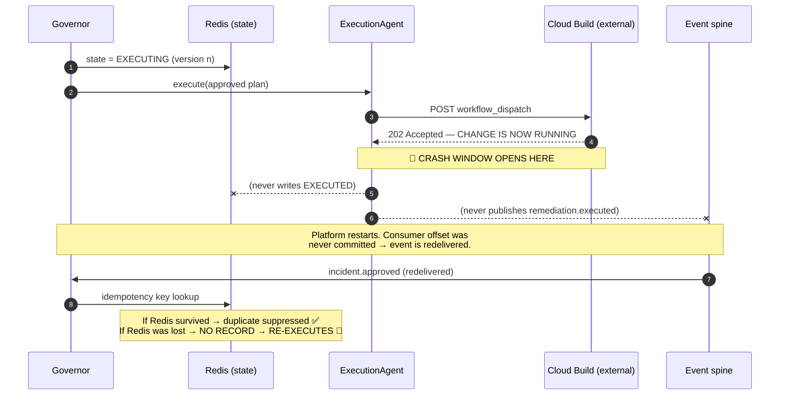
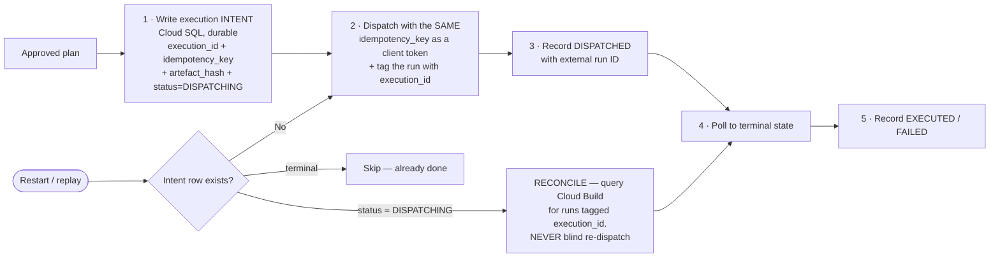
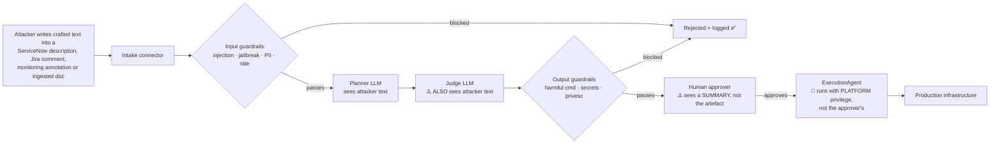
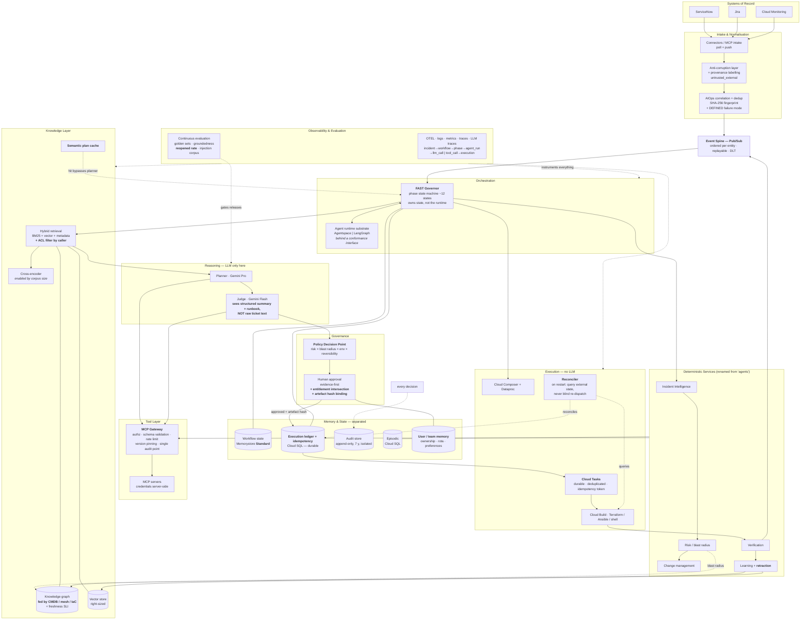

# Enterprise Agentic AI Architecture — Independent Critical Review

**Reviewer role:** Principal Enterprise AI / Agentic Platform Architect
**Subject:** Enterprise Agentic Platform v7.0 "FAST" + Data Agent APEX v2.1 (GCP Agentspace edition)
**Sources reviewed:** `Master_Documentation.md`, `Master_Documentation.html`, `gcp_agentspace_architecture.html`, `project_demo_presentation.html`
**Posture:** Adversarial. This review exists to find problems before implementation, not to validate the design.

---

> [!IMPORTANT]
> **Headline verdict: PARTIALLY production-ready.**
>
> This is materially better than most agentic platforms I review. The governance spine is real, the deterministic-flow decision is correct, and the restraint on LLM usage (3 of 14 archetypes) shows genuine engineering judgement rather than AI theatre.
>
> **But there is one architectural defect that is a hard blocker**, and it is in the most dangerous place possible: the window between dispatching a production change and recording that you dispatched it. Everything else on the Must-Have list is tractable within a quarter. That one is not optional.

---

## Table of Contents

- [1. End-to-End Workflow Review](#1-end-to-end-workflow-review)
- [2. Agent Architecture Review](#2-agent-architecture-review)
- [3. Memory Architecture — Critical Review](#3-memory-architecture--critical-review)
- [4. State Management — Critical Review](#4-state-management--critical-review)
- [5. RAG Architecture Review](#5-rag-architecture-review)
- [6. GraphRAG / Knowledge Graph Review](#6-graphrag--knowledge-graph-review)
- [7. MCP Architecture Review](#7-mcp-architecture-review)
- [8. Observability / AgentOps Review](#8-observability--agentops-review)
- [9. Security Architecture](#9-security-architecture)
- [10. Human-in-the-Loop](#10-human-in-the-loop)
- [11. GCP Architecture Review](#11-gcp-architecture-review)
- [12. Azure Comparison](#12-azure-comparison)
- [13. Reliability & Failure Scenarios](#13-reliability--failure-scenarios)
- [14. Cost & Performance](#14-cost--performance)
- [15. Architecture Standards & Design Patterns](#15-architecture-standards--design-patterns)
- [16. Agent Evaluation / Testing](#16-agent-evaluation--testing)
- [17. Architecture Scorecard](#17-architecture-scorecard)
- [18. Final Deliverables](#18-final-deliverables)

---

# 1. End-to-End Workflow Review

## 1.1 Stage-by-stage trace

Columns: **State created**, **Memory R/W**, **Tools**, **Telemetry**, **On failure**, **Idempotency**.

| # | Stage | Component | State created → where | Memory read / written | RAG / tools | Telemetry | Failure behaviour | Duplicate protection |
|---|---|---|---|---|---|---|---|---|
| 1 | Ticket raised | ServiceNow / Jira / Cloud Monitoring | Ticket in external SoR | — | — | External | N/A | N/A |
| 2 | Intake | Agentspace connector (MCP `servicenow-mcp`) polls 30 s | Normalised payload (in-flight) | — | `fetch_incidents` | Connector metrics | Circuit breaker 5/30 s; incidents queue in SoR | Poll is re-entrant; dedup happens at 4 |
| 3 | Correlate + dedup | AIOps correlator | SHA-256 fingerprint → **Redis** | W: fingerprint | — | `−94%` noise metric | ⚠️ **Undefined** — doc does not state behaviour if correlator fails | Fingerprint match → `DUPLICATE` terminal |
| 4 | Publish | Kafka/Pub-Sub producer | `incident.created` → **event spine** | — | — | Producer ack metric | `acks=all`; retry | Partition key `incident_id` |
| 5 | Route | Event Orchestrator | Consumer offset | — | — | Consumer lag | Manual commit after success | Offset semantics |
| 6 | Workflow init | FAST Governor | `wf-{uuid4}` + state `NEW` → **Redis** | W: workflow state | — | Span `incident_ingestion` | Escalate | `correlation_id`+`event_id` in Redis |
| 7 | Intake phase | IncidentIntelligence | `ANALYZING`→`RCA_COMPLETE` | R: Neo4j correlation, W: RCA | 15 rules + LLM | Audit row | Conservative context, low confidence | Idempotency key |
| 8 | Parallel analysis | RiskAgent ∥ ChangeMgmt | `RISK_ASSESSED`, `CHG_CREATED` | R: Neo4j `DEPENDS_ON` | `create_change_request` | Spans | Risk→`CRITICAL`; CHG→local number | Idempotency key |
| 9 | Retrieve | Swarm RAG | Candidates (in-flight) | R: vector + graph + cache | `search`, `search_graph` | `rag_search` span | <2 agents → escalate | Read-only |
| 10 | Plan | Planner (Gemini Pro) | `PLAN_GENERATED` | R: retrieved evidence | LLM | Langfuse trace | Circuit breaker → secondary → template + mandatory human | Bounded |
| 11 | Judge | Judge (Gemini Flash) | `JUDGE_PASSED`/`FAILED` | R: plan + RAG | LLM | Langfuse trace | Unavailable → mandatory human review | Max 2 revisions |
| 12 | Route approval | ApprovalAgent | `PENDING_APPROVAL` | W: approval record → **PostgreSQL** | — | Audit | Escalate → auto-**reject** | Approval ID |
| 13 | Human decides | UI / chat | `APPROVED` → **Kafka + PostgreSQL** | W: audit w/ identity | — | Audit + dwell time | 60 min → auto-reject | **Outbox (only place it exists)** |
| 14 | **Execute** | **ExecutionAgent → Cloud Build** | **`EXECUTING`→`EXECUTED`** | — | `dispatch_workflow` | Span | Auto-rollback | 🔴 **SEE §4.3 — GAP** |
| 15 | Verify | VerificationAgent | `VERIFYING`→`VERIFIED` | R: health targets | `query_monitoring`, k8s | Span | Rollback → escalate | Read-mostly |
| 16 | Close | Ticket Closer | `CLOSING`→`CLOSED` | — | `close_incident` | Audit | Retry | Close is idempotent in SNOW |
| 17 | Learn | LearningAgent | `FIXED_BY` → **Neo4j**, doc → **vector store**, weights | W: episodic + semantic | `index_result` | Metric | Buffer in Redis, retry | ⚠️ MERGE increments counters — **replay double-counts** |
| 18 | Audit | ObservabilityAgent | Checksummed record, 7 y | W: audit | — | All four pillars | Best-effort, non-blocking | — |

## 1.2 Broken or unclear lifecycle transitions

| # | Transition | Problem | Severity |
|---|---|---|---|
| **T1** | **14 → 15** (dispatch → acknowledge) | The forward action leaves the platform (Cloud Build REST call) **before** any durable record of the dispatch exists. Only the Redis state machine knows. See §4.3. | 🔴 **Critical** |
| **T2** | **17 (learning) on replay** | `MERGE (i)-[r:FIXED_BY]->(s) SET r.success_count = COALESCE(...) + 1` is **not idempotent**. An event replay re-increments success counts and skews future ranking. | 🟠 High |
| **T3** | **3 (correlator failure)** | The doc defines fail-safe behaviour for 9 agents but never for the AIOps correlator or the idempotency check. If the correlator fails open, noise floods the workflow engine; if it fails closed, incidents are dropped. Unspecified = unsafe. | 🟠 High |
| **T4** | **13 → 14** (approve → execute) | The approver approves a **plan summary**. Execution runs a **rendered artefact**. Nothing cryptographically binds the two. TOCTOU window. | 🟠 High |
| **T5** | **16 (closure) horizon** | Closure is driven by verification at T+stabilisation-window. Nothing reopens the loop if the incident recurs at T+3 days. Learning has already recorded success. | 🟠 High |
| **T6** | **15 → 16 partial** | If verification passes but ticket closure fails permanently, the workflow has no defined terminal state other than escalation — but the knowledge base has already been updated (17 runs after 16 in the doc, but the ordering guarantee isn't stated). | 🟡 Medium |

---

# 2. Agent Architecture Review

## 2.1 The core finding: these are mostly not agents

The Master Doc states plainly that **only 3 of 14 archetypes use an LLM** (Planner, Analyst, Critic) and treats this as a design strength. It is. But the naming has not caught up with the design, and that has real consequences.

| "Agent" | What it actually is | Should be |
|---|---|---|
| **Governor** | A state machine + scheduler | ✅ Keep as orchestrator (not an agent) |
| **IncidentIntelligence** | 15 rules + optional LLM enrichment | ✅ Genuine hybrid agent — keep |
| **RiskAgent** | A Neo4j BFS query + threshold logic | ➡️ **Deterministic service** |
| **ChangeManagement** | A ServiceNow API client | ➡️ **Deterministic service / tool** |
| **Planner** | LLM | ✅ Genuine agent |
| **Judge** | LLM | ✅ Genuine agent |
| **ApprovalAgent** | Policy evaluation + routing table | ➡️ **Policy service (ideally OPA)** |
| **ExecutionAgent** | Dispatcher with retry | ➡️ **Durable job runner** |
| **VerificationAgent** | Health-check runner | ➡️ **Deterministic service** |
| **LearningAgent** | Indexer | ➡️ **Async job / consumer** |
| **ObservabilityAgent** | Logging/metrics hooks | 🔴 **Not an agent at all — this is middleware.** Calling a cross-cutting aspect an "agent" is a category error that leaks into the diagrams and confuses reviewers. |

> [!WARNING]
> **Why this matters beyond semantics.** Every component labelled "agent" invites a future engineer to give it an LLM. The naming creates a gravitational pull toward exactly the agent sprawl the architecture is trying to avoid. I have seen this specific failure three times: a "RiskAgent" that was a graph query in v1 becomes an LLM call in v3 because "it's an agent, agents reason."

**Recommendation:** rename to **`FAST Workflow` with 2 reasoning nodes and 7 deterministic services**, plus observability middleware. Keep `BaseAgent` as the shared lifecycle contract — that abstraction is genuinely good and worth preserving. This is a documentation and naming change, not a re-architecture.

## 2.2 Coupling assessment

| Dimension | Assessment |
|---|---|
| Agent → agent | ✅ **Good.** Hub-and-spoke; agents do not call each other. Audit trail stays linear. |
| Agent → state | ⚠️ All agents share one Redis and one state schema. Acceptable at this scale, but there is no per-agent state isolation. |
| Agent → tools | ✅ Allowlisted per agent. |
| Agent → orchestrator | 🔴 The 24-state machine encodes agent-specific states (`CHG_CREATED`, `JUDGE_PASSED`). **The orchestrator knows the internals of its workers.** Adding a 10th agent means editing the state enum. This is the main extensibility limit. |

**Recommendation:** collapse to a **phase-based state machine** (`INTAKE → ANALYSIS → PLANNING → APPROVAL → EXECUTION → VERIFICATION → CLOSURE` + failure/terminal states ≈ 12 states) with per-phase sub-status held as workflow data. You lose nothing auditable — the audit trail lives in the event log, not the enum — and you gain the ability to add agents without a schema migration.

## 2.3 Where an LLM is used and should not be

| Location | Verdict |
|---|---|
| Planner | ✅ Correct — genuine ambiguity |
| Judge | ✅ Correct — independent evaluation |
| IncidentIntelligence LLM enrichment | ⚠️ **Question it.** 15 rules do the classification; the LLM "enriches". Measure the delta. If enrichment doesn't move `recommendation_rank`, delete it — it is on the critical path of every incident. |
| APEX NL normaliser | ✅ Correct — free text → structure is exactly the right LLM job, and it is gated by preview + 80% confidence |
| APEX "truly novel → LLM generates a new Jinja2 template" | 🟠 **Highest-risk LLM use in the platform.** An LLM generating a *reusable pattern* that then generates *many* pipelines is a force multiplier for a single bad generation. It is human-approved, which helps. Require: template must pass the full validator suite **plus** a golden-set render test **plus** two reviewers before it becomes P10+. |

**Where deterministic code should replace an LLM:** nowhere significant — you have already done this work. This is the strongest single aspect of the architecture.

---

# 3. Memory Architecture — Critical Review

## 3.1 The taxonomy is storage-shaped, not memory-shaped

Master §13.11 lists five "memory types": Working (Redis), Episodic (PostgreSQL), Semantic (Weaviate/Vertex), Relational (Neo4j), Cache. **That is a list of datastores, not a memory model.** Mapping it to the memory taxonomy that actually matters:

| Memory type | Present? | Where | Verdict |
|---|---|---|---|
| **Working memory** | ✅ | Explicit context assembly per LLM call | ✅ Excellent — "no implicit memory between calls" is exactly right |
| **Session / conversation memory** | ❌ **Absent** | — | Acceptable *today* (no conversational surface). **Becomes a gap the moment Agentspace exposes a chat/search UI**, which the deck implies |
| **Workflow memory** | ⚠️ Conflated | Redis, same store/TTL as everything else | Split it out |
| **Episodic memory** | ✅ | PostgreSQL + resolved incidents in vector store | Good |
| **Semantic memory** | ✅ | Vector store + `registry.json` | Good, versioned in Git |
| **Long-term / procedural** | ✅ | Neo4j `FIXED_BY` + tuned fusion weights | Good — genuinely the best part of the memory design |
| **User / team memory** | 🔴 **Absent** | — | **Real gap.** No approver preferences, no team ownership context beyond `business_owner`, no on-call awareness, no "this team always rejects auto-restarts on payment-service" |

## 3.2 The Redis conflation problem

One Memorystore instance holds **five concerns with incompatible lifecycles**:

| Concern | Natural TTL | Loss consequence |
|---|---|---|
| FAST 24-state machine | 30 d | Workflow orphaned |
| LangGraph workflow state | Duration of workflow | Workflow orphaned |
| **Idempotency keys** | ≥ replay window | 🔴 **Duplicate execution** — and this is the one key class whose loss is unrecoverable |
| Embedding cache | 24 h | Latency only |
| Pending approvals | Hours | Approval lost |
| Learning-agent retry buffer | Minutes–hours | Learning lost |

An eviction-policy or memory-pressure event on this instance does not degrade gracefully — it degrades **differently per key class**, and the class with the worst failure mode (idempotency) has no special protection.

> [!CAUTION]
> **Two separate issues here — one minor, one material.**
>
> **Minor (documentation):** the §3.5 cost table lists Memorystore as *"Basic tier, 5 GB"*, while §7.5 and §7.9 correctly specify *"Basic tier in dev, Standard HA in production"* with replica failover. The **design is right**; the cost table is inconsistent with it. Fix the table.
>
> **Material (design):** **Redis durability semantics are never specified anywhere in the documentation** — no statement of RDB/AOF persistence, replication mode, or the data-loss window on failover. Memorystore Standard gives **replica failover, which is availability, not durability**: replication is asynchronous, so a failover can lose recent writes. §3.12 acknowledges losing Redis costs "workflow state persistence, pause/resume, embedding cache" — but **not** that it costs the idempotency keys on which the entire replay-safety guarantee depends. That omission is the real finding, and it holds at any tier.

## 3.3 Missing memory operations

| Operation | Present? | Gap |
|---|---|---|
| Retrieve | ✅ | — |
| Update | ✅ | — |
| Version | ✅ | `registry.json` in Git + population run recorded — genuinely excellent, most teams miss this |
| **Detect stale** | ❌ | No freshness signal on runbooks or on the service dependency graph |
| **Correct / retract** | 🔴 **Absent** | The learning loop only ever **adds** and **increments**. There is no path to retract a `FIXED_BY` edge when a "successful" fix is later found to have caused harm. §21.12 R-05 claims control via "human review of new runbooks" — but **resolved incidents are indexed automatically with no human review**. Stated control ≠ implemented control. |
| Delete | ⚠️ | PII 90 d covered; no per-asset deletion path for a poisoned memory |
| Protect sensitive | ✅ | Pre-LLM redaction is correct |
| Prevent cross-ticket contamination | ✅ per-workflow / 🔴 **globally** | Workflows are isolated, but the **learning loop is global and unmoderated**. One successful resolution of a maliciously-crafted incident poisons ranking for everyone. |

## 3.4 Memory ≠ State ≠ RAG ≠ Conversation

| Conflation | Where | Fix |
|---|---|---|
| **Workflow state mixed with idempotency mixed with cache** | One Redis | Split into 3 stores/namespaces with independent policies; move idempotency to a durable store |
| **Episodic memory doubles as RAG corpus** | Resolved incidents indexed into the vector store | Defensible and deliberate — but it means **operational data and knowledge share a trust boundary**. A poisoned incident becomes retrievable knowledge with no gate. Add a moderation/confidence gate before an incident becomes retrievable. |
| **Semantic memory is also the deployment artefact** | `registry.json` | ✅ Fine and good |

---

# 4. State Management — Critical Review

## 4.1 What is stored, and where

| Element | Store | Durable? | Assessment |
|---|---|---|---|
| Ticket ID | External SoR + event key | ✅ | ✅ |
| Workflow ID | Redis | 🔴 **Not durably** | Reconstructable from event log |
| Current step / 24 states | Redis (optimistic lock, version counter) | 🔴 | Reconstructable by replay |
| Agent decisions | PostgreSQL audit | ✅ | ✅ |
| Tool calls / results | Metrics + traces + audit | ⚠️ | Traces are sampled and short-retention — **not a durable execution record** |
| RAG references | Audit (explanation) | ✅ | ✅ |
| Human approvals | PostgreSQL **+ outbox** | ✅ | ✅ Best-handled path in the system |
| Retry count | Redis | 🔴 | Lost on Redis loss → retry budget resets |
| Resolution / closure | External SoR + audit | ✅ | ✅ |

## 4.2 Mechanism assessment

| Mechanism | Status | Note |
|---|---|---|
| State persistence | ⚠️ | Redis-primary; **durability semantics undefined** (§3.2) |
| State transitions | ✅ | Explicit, validated |
| Checkpointing | ⚠️ | Implicit via state writes; no explicit checkpoint barrier around external side effects |
| Resume after failure | ✅ **for pause/approve**, 🔴 **for mid-execution** | See §4.3 |
| Idempotency | ⚠️ | Correct design, **wrong storage tier** |
| Duplicate events | ✅ | Fingerprint + event key |
| Concurrency / races | ✅ | Optimistic locking with version counter is the right choice |
| Distributed locking | ✅ | Avoided deliberately — correct |
| Timeout handling | ✅ | Stuck detection at 5 min; approval ladder |
| DLQ | ✅ exists / ⚠️ manual drain | "On-call reviews via Cloud Console" is not an operational process at scale |
| Compensation | ✅ | Rollback generated **before** execution — excellent |
| Long-running workflows | ✅ | Pause/resume across approval is properly designed |

## 4.3 🔴 The critical finding — the dispatch/acknowledge window

**The question asked:** *if the platform crashes halfway through an incident, can it restart and continue safely without repeating dangerous actions?*

**The honest answer: no — not in one specific, narrow, and highly dangerous window.**



**Three compounding problems:**

1. **No write-ahead intent record.** Nothing durable is written *before* the external call. The only evidence the dispatch happened lives in Redis and in Cloud Build.
2. **Idempotency keys live in the same volatile store as workflow state.** Master §3.20 asserts *"Event replay required — RPO 0, RTO minutes; idempotency prevents duplicates."* **That guarantee is only as durable as Redis**, which per §3.5 is Basic tier. The DR table's confidence is not earned.
3. **The outbox pattern covers only the approval path** (§5.2, self-declared "Partial"). The execution path — the one that changes production — has the weakest durability in the system. This is exactly backwards.

**Compounding factor:** not all remediations are naturally idempotent. `terraform apply` largely is. `restart_deployment` is (mostly). An arbitrary shell runbook is **not**. The architecture treats them uniformly.

### Required fix (Must Have)



**Non-negotiables in that fix:**
- The execution ledger is in **Cloud SQL, not Redis**.
- Idempotency keys move to **Cloud SQL** (Redis may cache them, but is not the source of truth).
- Reconciliation-on-restart is **mandatory** and must query the external system rather than assume.
- Every runbook is **classified** `idempotent | conditionally-idempotent | non-idempotent`, and non-idempotent runbooks **may not auto-retry** — they escalate.

Until this exists, I would not run this platform against production infrastructure with auto-approval enabled.

---

# 5. RAG Architecture Review

## 5.1 What is genuinely excellent

The fusion engineering is better than most production systems I see. Specifically:
- **RRF over ranks rather than scores** — correct, and the ADR reasoning (scale-invariance, no weight tuning, graceful agent failure) is sound.
- **Two-stage retrieval** (bi-encoder recall → cross-encoder precision) — textbook correct.
- **Minimum-2-agent consensus, else escalate** — the right refusal behaviour.
- **Outcome-based evaluation** via `recommendation_rank` and verified success — this is the strongest evaluation signal available and most teams never build it.
- **Multi-tier embedding cache** — correct.

## 5.2 🔴 Access-control-aware retrieval is absent

There is **no document-level authorization in the retrieval path.** Retrieval filters by risk (blast radius) and metadata (cloud/service/env), never by **requesting identity**.

- **Today:** tolerable. 23 first-party runbooks, all operational, no user-specific sensitivity.
- **The moment Agentspace's 100+ connectors ingest Confluence / Drive / SharePoint** — which both the architecture doc and the deck position as the direction of travel — **this becomes a data-leak vector**: an `operator` asks a question, the agent retrieves a document they are not entitled to read, and the LLM summarises it back to them. The ACL was on the source system; the vector index has none.

**Fix:** ACL-aware indexing (Vertex AI Search supports document ACLs natively), retrieval filtered by the **caller's** principal, and an explicit test in `tests/security/` proving a low-privilege caller cannot retrieve a restricted document. **This must land before any non-runbook corpus is indexed.**

## 5.3 🟠 The pipeline is over-built for the corpus

**23 scripts. 136 synthetic incidents.** Against that corpus you are running: query understanding → 4 parallel retrievers → RRF → cross-encoder reranking **of the top 20 out of 23 documents** → blast-radius filter.

Reranking 20 of 23 candidates is close to a no-op with a 100–150 ms cost. Four-way fusion over 23 documents is dominated by the metadata filter.

I am **not** saying delete it — the interface is right and the corpus will grow. I am saying:
- Measure it. Run BM25 + metadata filter as a baseline and compare `recommendation_rank`. If the delta is small, **disable the cross-encoder by default** (the flag already exists) until the corpus justifies it.
- Vertex AI Search Enterprise at **$300/month for 23 documents** is not defensible. Vector Search or even pgvector on the existing Cloud SQL would serve this corpus.

## 5.4 🟠 The graph signal is currently measuring fiction

Bootstrap seeds **136 synthetic incidents with success probability assigned by risk level** (low 95%, medium 85%, high 70%, critical 60%). The graph agent's score is `0.40·fixed_count + 0.30·success_rate + 0.20·speed + 0.10·recency`.

Until real history accumulates, **the graph agent is ranking on the seeder's assumptions**, and it carries the highest weight in that formula. Worse, it looks like evidence — the UI shows "15 historical successes" to an approver who has no way to know those were generated.

**Fix:** flag synthetic edges (`synthetic: true`), exclude them from `match_reasons` shown to humans, and decay their weight to zero as real observations arrive.

## 5.5 Remaining pipeline gaps

| Stage | Status | Gap |
|---|---|---|
| Chunking | ✅ | Logical-unit chunking per script type is correct |
| Metadata | ✅ | Rich |
| Query rewriting | ⚠️ | Expansion only; no HyDE / multi-query |
| Context compression | ❌ | Absent. Fine at 23 docs; needed as corpus grows |
| **Citation enforcement** | ⚠️ | "Grounding check verifies claims against RAG source documents" — **mechanism unspecified**. LLM-based? String match? Unverifiable as documented, and it is load-bearing for the Article 13 explainability claim |
| Freshness | ❌ | No document TTL, no staleness signal on runbooks |
| Retrieval evaluation | ⚠️ | Outcome metrics exist (excellent, but lagging). **No offline golden set with recall@k / nDCG that blocks a deploy** |

---

# 6. GraphRAG / Knowledge Graph Review

## 6.1 Verdict: justified, but for one reason more than the other

| Use | Verdict |
|---|---|
| **`DEPENDS_ON` → blast radius via BFS** | ✅ **This alone justifies Neo4j.** Multi-hop reachability is genuinely graph-shaped; SQL recursive CTEs get ugly and slow. It feeds risk routing, which feeds approval level. Correct design. |
| **`FIXED_BY` → historical success** | ⚠️ **Does not need a graph.** This is `(incident_type, script_id) → count, success_rate, avg_time` — a relational aggregate with two indexes. It is in Neo4j because Neo4j was already there. Defensible, not required. |

## 6.2 🟠 The dependency graph has no freshness mechanism

16 service nodes and 17 `DEPENDS_ON` edges are **populated by a bootstrap script**. There is no ingestion from a CMDB, service mesh, or IaC state.

**A hand-maintained dependency graph in a real enterprise is stale within weeks.** And this is not a cosmetic staleness — the chain is:

> stale graph → wrong blast radius → wrong risk level → **wrong approval tier** → a HIGH-risk change routed as MEDIUM and approved by someone without the authority to approve it.

That is a governance failure dressed as a data-quality problem, and the audit trail will look perfectly clean while it happens.

**Fix (Must Have if blast radius drives approval routing):** derive `DEPENDS_ON` from ServiceNow CMDB relationships, Anthos Service Mesh telemetry, or Terraform state — and publish a **graph freshness SLI** (`% of services with a dependency edge updated in the last N days`) with an alert.

## 6.3 Placement guidance

| Data | Correct home | Currently |
|---|---|---|
| Service topology, multi-hop reachability | **Graph** | ✅ Neo4j |
| Incident ↔ script outcome aggregates | **Relational** | ⚠️ Neo4j (acceptable) |
| Runbook text + embeddings | **Vector** | ✅ |
| Audit, executions, metadata | **Relational** | ✅ Cloud SQL |
| Artefacts, lake data | **Object** | ✅ GCS |
| Workflow state | **Durable KV / relational** | 🔴 Redis Basic (see §3.2) |

**Use GraphRAG when** the question is multi-hop and structural ("what breaks if I restart this"). **Use vector RAG when** the question is semantic ("what does this error mean"). This architecture uses each correctly.

---

# 7. MCP Architecture Review

## 7.1 What is right

**Server-side credential isolation is the single best security decision in this architecture.** The model asks for a named tool; the server holds the credential. A successful injection that says "print all secrets" finds nothing. Plus: typed schemas, `tools/list` discovery, per-agent allowlists, dry-run support, per-tool metering.

## 7.2 🔴 There is no MCP Gateway / Policy Decision Point

Current topology: `Agent → MCP client → 7 MCP servers → enterprise systems`. Authorization is **per-agent allowlist configuration**, evaluated by the caller.

Missing single choke point for:

| Control | Today | Needed |
|---|---|---|
| Centralised authz decision | Config-based allowlist | **PDP (OPA/Cloud IAM) evaluating every call** |
| Parameter-level policy | ❌ | `restart_deployment` allowed — but on *which* namespace? `apply` allowed — on *which* workspace? |
| Tool version pinning | Declared, not enforced | Enforced at the gateway |
| Rate limiting per tool | ❌ (only per-identifier input rate limiting) | Per-tool, per-agent budgets |
| Egress control | Cloud NAT allowlist | Gateway-level destination policy |
| Single audit choke point | Per-server | One place that sees every tool call |
| Third-party server vetting | N/A (all first-party) | **Required before any Agentspace third-party connector** |

**You need the gateway. Recommend it explicitly.** Not because the current 7 first-party servers are unsafe, but because the moment connector count grows past first-party, per-agent config allowlists become unauditable drift.

## 7.3 🔴 Confused deputy on execution privilege

**This is the most serious security finding.**

The `ExecutionAgent` executes with the **platform's** service account. The human approver's identity is captured for audit — but is **never used to scope the action**.

Therefore:
- An `approver` who is entitled to approve changes in *staging* can approve a plan targeting *production*, and it executes with full platform privilege.
- There is **no privilege intersection** between "what this human may do" and "what the platform then does on their behalf."
- Audit records *who approved*, creating the appearance of accountability without the substance of authorization.

**Fix:**
1. Validate at approval time that the approver's entitlements cover the **target environment and service**, not merely the role `approver`.
2. Prefer token exchange / workload identity impersonation so the action executes **as** (or constrained by) the approver's entitlements.
3. Split the `approver` role by environment and blast-radius tier.

## 7.4 Prompt injection → tool → enterprise system

The chain is genuinely layered. But one gap:

> [!WARNING]
> **The judge is not independent of the injection — verified in the prompt itself.** The documented judge prompt (§13.6) opens with `Original Incident: {incident_context}`. Planner and Judge therefore both receive the same attacker-controlled text, which any employee or integrated monitoring system can write into a ServiceNow description. Using a *different model family* defends against **shared model bias**. It does **not** defend against **shared poisoned input**.
>
> **Fix:** the judge should evaluate `(plan, retrieved runbook, structured incident summary)` — not the raw description. The genuine backstop is output-side harmful-command detection, which exists and is good; make it the primary control rather than the last one.

**Tool poisoning:** not currently exploitable (all servers first-party), but there is no control described. Tool *descriptions* enter the model's context — a malicious or compromised third-party MCP server can inject instructions via its tool schema. Gate third-party connectors on review before enabling.

---

# 8. Observability / AgentOps Review

## 8.1 Strong foundation

Four pillars including **LLM tracing** puts this ahead of most enterprise deployments. The reasoning ("when an agent produces a wrong plan the question is not how long it took, but what exactly we asked and what it said") is exactly right, and correlating everything on `incident_id` — down to `_run_id` on individual data rows — is genuinely excellent.

## 8.2 The correlation model is one level too coarse

Requested chain vs. reality:

| Required ID | Present? | Gap |
|---|---|---|
| `ticket_id` | ✅ `incident_id` | — |
| `workflow_id` | ✅ | Not durable (Redis) |
| `trace_id` | ✅ | — |
| `agent_run_id` | ⚠️ `agent_id = {name}_{uuid}` | Present in logs; **not correlated into Langfuse or metrics** |
| `llm_call_id` | 🔴 **Missing** | `trace_id = incident_id` in Langfuse **collapses per-call identity**. You cannot point at one metric spike and land on one specific model call |
| `tool_call_id` | 🔴 **Missing** | No per-invocation identifier — cannot join a tool failure to its downstream effect |
| `approval_id` | 🔴 **Missing** | Approval is a first-class state transition and deserves an ID |
| `execution_id` | 🔴 **Missing** | Required anyway by the §4.3 fix |

**Fix:** hierarchical IDs propagated as OTEL baggage and stamped on every signal:
`incident_id → workflow_id → phase_id → agent_run_id → {llm_call_id | tool_call_id} → execution_id`

## 8.3 Missing metrics

| Category | Missing |
|---|---|
| **RAG** | 🔴 groundedness score, citation accuracy, recall@k / nDCG against a golden set, retrieval-score distribution drift |
| **Agent** | 🔴 loop/revision count per workflow, handoff count, **per-phase** duration breakdown |
| **MCP** | 🔴 **authorization decision per call** (allow/deny + reason), parameter-level audit, dry-run vs live |
| **Business** | 🔴 **reopened-ticket rate** (see below), cost **per ticket**, automation % by incident class, human override rate |
| **Memory** | 🔴 cache hit ratio by tier, KB staleness age, graph freshness |

> [!IMPORTANT]
> **Reopened rate is the missing keystone metric.** Verification proves recovery at T+stabilisation-window. It says nothing about T+3 days. The learning loop has *already* recorded success and incremented `FIXED_BY`. **A remediation that masks a symptom rather than fixing a cause will be positively reinforced.** Without reopened-rate feedback, the system can become confidently wrong in a way that is invisible to every metric it currently collects.

## 8.4 Tooling

OTEL + Cloud Trace + Cloud Logging + Langfuse is the right stack. One caution: **traces are sampled and short-retention; audit is not.** Keep the compliance-grade record in the audit store, never in traces — the doc does this correctly, but make it an explicit invariant so nobody "optimises" audit into tracing later.

---

# 9. Security Architecture

## 9.1 Threat model — the injection path



**Boundary-by-boundary controls:**

| Boundary | Present | Gap |
|---|---|---|
| Ingest → platform | Pattern + classifier detection | ✅ Good. Add provenance labelling (`untrusted_external`) that persists into the prompt |
| Guardrail → planner | Redaction, length, rate | ✅ |
| Planner → judge | Different model family | 🟠 **Shared poisoned input** (§7.4) |
| Judge → human | Evidence-first payload | 🟠 **Summary ≠ artefact** (TOCTOU, §1.2 T4) |
| Human → execution | Identity from verified token | 🔴 **Confused deputy** (§7.3) |
| Execution → infra | Allowlist, dry run, rollback | ✅ Strong |

## 9.2 Other findings

| # | Finding | Severity |
|---|---|---|
| S1 | **`AUTH_BYPASS=true` grants admin to every request.** Documented as local-only and self-flagged as needing a smoke-test assertion — **but that assertion is not in the CI gate list.** A misconfigured promotion is an unauthenticated admin API on the internet | 🔴 Critical (trivial to fix) |
| S2 | **HS256 (symmetric) JWT** — the verifying service can also mint tokens. RS256/OIDC is named as the production path but not evidenced as complete | 🟠 High |
| S3 | **Confused deputy** (§7.3) | 🔴 Critical |
| S4 | **No approved-artefact hash binding** — approval and execution are not cryptographically linked | 🟠 High |
| S5 | **No ACL-aware retrieval** (§5.2) | 🟠 High (becomes Critical on connector expansion) |
| S6 | Guardrails are pattern + classifier based — **injection detection is a known-unsolved problem**; treat as defence-in-depth, never as a boundary | 🟡 Medium (correctly positioned in the docs) |
| S7 | **No OWASP LLM Top 10 mapping** — ATLAS is mapped, which is the better primary choice, but OWASP LLM is what pen-test vendors ask for | 🟡 Medium |

**Well handled:** CMEK, VPC-SC, Workload Identity, mTLS, secret rotation, 7-year checksummed audit, least-privilege service accounts, group-based IAM with quarterly recertification.

---

# 10. Human-in-the-Loop

## 10.1 This is the strongest area of the architecture

Evidence-first payloads, four-level risk routing, escalation that ends in **auto-reject rather than auto-approve**, an `ESCALATED` escape hatch from any state, Shadow-mode kill switch, and — unusually — explicit awareness that **approval fatigue makes a gate into theatre**, with dwell time as the automation-bias indicator. That last point is something most teams discover only after an incident.

## 10.2 Risk classification — validated with corrections

| Action | Doc position | My assessment |
|---|---|---|
| Read logs, query monitoring | Auto | ✅ |
| Query database (read-only) | Auto | ✅ **provided** the connection is genuinely read-only at the credential level, not by convention |
| Restart a stateless service, non-prod | Auto-approve if all 5 criteria | ✅ Correct |
| Restart a **stateful** service | Not distinguished | 🔴 **Add this distinction.** Restarting a stateless pod and restarting a database primary are not the same risk class |
| Modify configuration | Standard | ⚠️ Should depend on blast radius, not action type |
| Execute SQL (write) | Not distinguished | 🔴 **Must be High + explicit** |
| Delete data | Not distinguished | 🔴 **Must be High/Executive + irreversibility check** |
| Change production infrastructure | Human always | ✅ |
| Close incident | Automatic after verification | 🟠 **Reconsider** — closure with no reopened-rate feedback (§8.3) means the loop closes on a metric that cannot see recurrence |
| Deploy application | Human always | ✅ |

**Missing dimension:** classification is by **action type**. It should be by **`action type × blast radius × environment × reversibility`**. You already compute blast radius — use it as a first-class input to the risk tier rather than only as approval-routing context.

**Missing operational piece:** no on-call/rota awareness. The escalation chain is static; it does not know who is actually on shift or on leave.

---

# 11. GCP Architecture Review

| Service | Used for | Verdict |
|---|---|---|
| **Pub/Sub** | Event spine | ✅ Correct. Ordering keys + DLT + snapshots cover the requirement without Kafka's operational burden |
| **Vertex AI (Gemini Pro/Flash)** | Planner / Judge | ✅ Correct, and the different-model-for-judge decision is right |
| **Vertex AI Search** | RAG | 🟠 **Over-provisioned.** Enterprise tier for 23 documents. Use Vector Search, or pgvector on existing Cloud SQL, until the corpus justifies it |
| **Agentspace** | Agent graph + connectors | ⚠️ **The one genuine lock-in seam.** See §12 |
| **Cloud Run** | Control plane + UI | ✅ Ideal — scale-to-zero, stateless |
| **GKE Autopilot** | Agents, orchestrator, stateful stores | ✅ Correct for long-running consumers |
| **Cloud SQL** | Audit + CQRS + APEX metadata | ⚠️ **Three workloads, one instance.** Append-heavy audit, read-heavy CQRS, join-heavy metadata will contend. Separate audit (or export to BigQuery) |
| **Memorystore** | State, cache, idempotency | ⚠️ Standard tier is correctly specified for production (§7.5), but **durability semantics are undefined** and idempotency keys should not depend on them — move those to Cloud SQL |
| **Cloud Composer** | Data pipeline orchestration | ✅ Correct for the data track. $400/mo fixed is the largest line — confirm it is justified by pipeline volume |
| **Dataproc** | Spark | ✅ Ephemeral + preemptible is right |
| **Cloud Build** | Governed execution | ✅ Correct |
| **Secret Manager / KMS / IAM / VPC-SC / Cloud Armor** | Security | ✅ All correctly applied |
| **Cloud Logging / Monitoring / Trace** | Observability | ✅ Correct |
| **Neo4j on GKE** | Graph | ⚠️ Only core store with no managed equivalent — needs an explicit HA decision |

## Services you are *not* using that you should consider

| Service | Why |
|---|---|
| **Cloud Tasks** | 🔴 **The right primitive for the §4.3 fix.** Durable, deduplicated, retryable task dispatch with per-task idempotency — exactly the missing execution semantics |
| **Workflows** | ⚠️ Considered and correctly rejected — LangGraph/Agentspace already owns this, and Workflows lacks the LLM-node ergonomics |
| **Eventarc** | Would simplify Cloud Monitoring → Pub/Sub wiring |
| **AlloyDB** | Only if Cloud SQL contention materialises |
| **Firestore** | ❌ Not needed |

**Deliberately not recommended just because they exist:** Dataflow (Spark on Dataproc is the documented and correct choice), Vertex AI Pipelines (no training), Model Garden (no self-hosting), Apigee (no external API product).

---

# 12. Azure Comparison

| Concern | GCP (as built) | Azure equivalent | Portability |
|---|---|---|---|
| Event spine | Pub/Sub | Service Bus / Event Hubs | ✅ Easy |
| Agent runtime | **Agentspace** | **Azure AI Foundry Agent Service** | 🔴 **Hard** |
| LLM | Vertex/Gemini | Azure OpenAI | ✅ Easy |
| RAG | Vertex AI Search | Azure AI Search | ✅ Easy — Azure AI Search is arguably stronger on **document-level ACL trimming**, the §5.2 gap |
| Vector | Vector Search | AI Search vector / pgvector | ✅ Easy |
| Graph | Neo4j on GKE | Neo4j on AKS / Cosmos Gremlin | ✅ Portable (self-hosted both sides) |
| Workflow durability | (missing) | **Durable Functions** | Azure has the stronger native answer here |
| Orchestration | Composer | Data Factory / Synapse | ⚠️ Medium — Airflow DAGs are portable, Composer config is not |
| Execution | Cloud Build | Azure DevOps / GitHub Actions | ✅ Easy |
| Identity | Workload Identity | Managed Identity + Entra Workload ID | ✅ Conceptually identical |
| Secrets | Secret Manager | Key Vault | ✅ Easy |
| Observability | Cloud Ops + Langfuse | Azure Monitor + Langfuse | ✅ Easy — Langfuse is already cloud-neutral |

## The real lock-in assessment

The portability claim is **substantially true and unusually well evidenced** — except in one place.

> [!WARNING]
> **Agentspace is the lock-in seam and the docs understate it.** The claim "LangGraph ↔ Agentspace, same deterministic-graph property" is an *assertion*. Graph semantics, state persistence, pause/resume behaviour and node contracts differ between the two. Swapping them is a port, not a config change.
>
> **This is fixable and you are most of the way there:** the docs already say *"the FAST Governor is custom code above LangGraph."* Make that boundary **explicit and enforced** — the Governor owns the state machine, and the graph runtime is a thin execution substrate behind an interface. Then prove it: **run the conformance suite against both LangGraph and Agentspace in CI.** A portability claim that is not executed in CI decays silently.

**Do not abstract anything else.** Pub/Sub, Cloud Run, Secret Manager and Cloud SQL abstractions would add cost with no realistic benefit.

---

# 13. Reliability & Failure Scenarios

| Scenario | Detect | Retry / Recover | Escalate | Verdict |
|---|---|---|---|---|
| LLM unavailable | Breaker | Secondary model → template + mandatory human | Auto | ✅ Excellent |
| LLM rate limited | 429 + breaker | Throttle + queue (correctly **not** retry-storm) | On budget breach | ✅ |
| Vector store down | Health check | BM25 fallback; RRF continues | If <2 agents | ✅ |
| Graph store down | Bolt check | Baseline score | — | ✅ **but** blast radius is unavailable → **risk routing degrades silently.** Should force conservative (higher) approval tier, not baseline |
| MCP server down | Breaker | Retry, then fail phase | Escalate | ✅ |
| ServiceNow down | Breaker 5/30 s | Queue in spine | — | ✅ |
| Database down | Readiness | 🔴 **Undefined** — audit writes are on the critical path for compliance. What happens: block, or proceed unaudited? **Must be "block"** and must be stated | 🔴 Gap |
| Agent crashes | K8s | Reschedule + replay | — | ✅ |
| Orchestrator crashes | K8s + lag | Replay from offset | — | ⚠️ Depends on §4.3 |
| Duplicate ticket event | Fingerprint + key | Suppress | — | ⚠️ Depends on Redis durability |
| **Tool succeeds, ack fails** | 🔴 **Not detected** | 🔴 **Blind re-dispatch possible** | — | 🔴 **See §4.3** |
| Human approval never arrives | Timer | 15/30/60 → auto-reject | Page | ✅ Excellent |
| RAG returns wrong info | Judge + human + verification | Rollback | Escalate | ⚠️ **Detected only after execution** if the judge is fooled by the same poisoned context |
| Agent infinite loop | Revision cap 2, stuck 5 min | Escalate | ✅ | ✅ |
| Repeated identical tool calls | 🔴 **Not detected** | — | — | 🟡 Add per-workflow tool-call budget |
| Network partition mid-execution | Poll timeout 600 s | ⚠️ Rollback assumes the forward action's state is known — it may not be | Escalate | 🟠 Reconcile-first, then decide |

**Two systemic gaps:** (1) the dispatch/ack window (§4.3); (2) **silent degradation of risk assessment** — when Neo4j is down, blast radius returns a baseline and approvals continue to route as though risk were known. Any degradation that affects *risk classification* must **raise** the approval tier, never keep it.

---

# 14. Cost & Performance

| Lever | Status | Recommendation |
|---|---|---|
| Token ceiling (50k/incident) | ✅ | Keep |
| Cost ceiling ($5/incident) | ✅ | Keep — genuinely good discipline |
| Model tiering | ✅ Pro plan / Flash judge | ✅ Correct |
| **Semantic caching of plans** | 🔴 **Absent** | **Highest-value cost win available.** Embedding cache exists; **plan cache does not**. Recurring incident types (disk full, pod crashloop) regenerate a near-identical plan every time. Cache on `(incident_fingerprint_class, service, env)` with human-visible "reused a cached plan" provenance |
| Cross-encoder | ⚠️ 100–150 ms/incident | Disable by default at current corpus size |
| Vertex AI Search Enterprise | 🔴 $300/mo for 23 docs | Downgrade until corpus justifies |
| Cloud Composer | ⚠️ $400/mo fixed | Justify against pipeline volume |
| Query understanding LLM call | ⚠️ | Optional flag exists — measure whether it beats rule-based expansion |
| IncidentIntelligence LLM enrichment | ⚠️ | Measure its contribution to `recommendation_rank`; delete if marginal |
| Logging/trace volume | ⚠️ | Sample traces; **never sample audit** |
| Cost **per ticket** | 🔴 Not measured | Add — you have per-model cost but not per-incident attribution surfaced |

**Performance ceilings not yet documented:** Redis hot-key contention on the state machine beyond ~10k concurrent workflows; Neo4j BFS latency as the CMDB graph grows (add a **blast-radius cache** — topology changes far less often than incidents occur); Cloud SQL contention across its three workloads.

---

# 15. Architecture Standards & Design Patterns

| Pattern | Status | Verdict |
|---|---|---|
| Supervisor / Orchestrator-workers | ✅ | Correct |
| Planner–Executor | ✅ | Correct; the *no-LLM-in-execution* separation is the best decision in the design |
| Router | ✅ deterministic | Correct — routing by topic prefix, not by model |
| Specialist agents | ⚠️ | Over-named (§2.1) |
| Event-driven | ✅ | Correct |
| **Saga / compensation** | ✅ design / 🔴 durability | Rollback-before-execution is excellent; the compensation record is not durable enough |
| **Durable workflow** | 🔴 **Partial** | The single biggest pattern gap. Cloud Tasks or a durable-execution engine is the answer |
| HITL | ✅ | Best-in-class |
| Circuit breaker | ✅ | Correct |
| Retry + backoff + jitter | ✅ | Correct |
| DLQ | ✅ / ⚠️ manual drain | Automate replay tooling |
| Idempotency | ⚠️ | Right idea, wrong storage tier |
| Policy enforcement | ⚠️ | Config-based; needs a PDP |
| Zero-trust tool execution | 🟠 | Undermined by the confused deputy |
| **Semantic caching** | 🔴 | Missing; recommended |
| Hybrid RAG | ✅ | Over-built for corpus, right for scale |
| GraphRAG | ✅ | Justified by blast radius |
| Agent evaluation | ⚠️ | Outcome-based (excellent) but no blocking offline gate |
| Continuous evaluation | ⚠️ | Shadow + canary exist; no automated quality regression gate |

**Patterns you should NOT add:** decentralised agent handoff (fragments the audit trail — your rejection is correct), ReAct in production (correctly forbidden), two-phase commit (Saga is right), a service mesh for agent-to-agent (hub-and-spoke is simpler and adequate), multi-agent debate (cost with no auditability gain).

---

# 16. Agent Evaluation / Testing

**Present:** unit, integration, e2e, llm, security, chaos, compliance, performance, regression, smoke suites; golden evaluation sets version-controlled; shadow mode; canary. **This is a strong testing posture.**

## Gaps

| Gap | Severity |
|---|---|
| **No blocking retrieval-quality gate in CI** — golden sets exist but no recall@k / nDCG threshold that fails a build | 🟠 High |
| **No MCP contract tests** — tool schema changes can break agents silently | 🟠 High |
| **No injection corpus regression** — `tests/security` exists; a *versioned adversarial corpus* that must stay at 0% bypass does not | 🟠 High |
| **No idempotency/replay test** — must prove: kill the platform mid-dispatch, restart, verify exactly-once side effects. **This is the test that would have caught §4.3** | 🔴 Critical |
| **No approval-authority test** — prove a low-privilege approver cannot authorise a production action (§7.3) | 🔴 Critical |
| **No ACL-retrieval test** — prove a low-privilege caller cannot retrieve a restricted document (§5.2) | 🟠 High |
| No statistical discipline on eval (sample size, significance) | 🟡 Medium |

## Representative end-to-end scenario to automate

```
GIVEN  a P2 incident "prod-api-01 unresponsive in us-central1-a"
WHEN   the workflow runs end to end
THEN   RCA classifies it correctly
AND    blast radius returns exactly {api-gateway, payment-service, auth-service}
AND    the correct runbook ranks #1
AND    the judge passes on all 5 criteria
AND    routing is STANDARD (production ⇒ never auto)
AND    execution is dispatched exactly once
AND    verification proves recovery
AND    the ticket closes with resolution notes
AND    FIXED_BY increments by exactly 1
AND    the audit record reconstructs the full decision

CHAOS VARIANTS (each must hold):
  kill the orchestrator after dispatch, before ack  → exactly-once, no double restart
  Neo4j down                                        → risk raised, NOT baselined
  judge unavailable                                 → mandatory human review
  approval times out                                → auto-REJECT, never auto-approve
  poisoned incident text                            → blocked at input OR output, never executed
  Redis flushed mid-workflow                        → workflow resumes or escalates; NEVER re-executes
```

---

# 17. Architecture Scorecard

Scored against **enterprise production readiness**, with evidence. No score above 8 without demonstrated evidence in the documentation.

| Area | Score | Key issues | Recommendation |
|---|---:|---|---|
| **Overall Architecture** | **7 / 10** | Excellent governance spine; one critical durability defect | Fix execution durability; then this is an 8–9 |
| **Agent Architecture** | **6 / 10** | Correct LLM restraint; misleading "agent" naming; orchestrator knows worker internals | Rename to workflow + services; collapse state machine to phases |
| **Orchestration** | **7 / 10** | Deterministic graph correct; hub SPOF accepted; stuck detection good | Decouple state enum from agent identity |
| **Memory** | **4 / 10** | Storage taxonomy ≠ memory taxonomy; no user/team memory; **no correction/retraction path**; five concerns in one Redis | Split stores; add retraction; add user/team memory |
| **State Management** | **4 / 10** | 🔴 Dispatch/ack window; idempotency in volatile store; outbox only on approval path | **Execution ledger in Cloud SQL + reconcile-on-restart — blocker** |
| **RAG** | **6 / 10** | Excellent fusion; **no ACL-aware retrieval**; over-built for 23 docs; graph signal is synthetic | Add ACL filtering; right-size; flag synthetic edges |
| **GraphRAG** | **6 / 10** | Blast radius justifies the graph; **dependency graph is hand-seeded and stale-prone** | Derive from CMDB/mesh; add freshness SLI |
| **MCP** | **6 / 10** | Credential isolation excellent; **no gateway/PDP**; **confused deputy** | Add MCP Gateway; bind execution to approver entitlements |
| **Observability** | **7 / 10** | Four pillars ahead of market; correlation one level too coarse; **no reopened rate** | Add `llm_call_id`/`tool_call_id`/`approval_id`; add reopened rate + groundedness |
| **Security** | **6 / 10** | Strong layered chain; confused deputy; judge sees poisoned input; AUTH_BYPASS not CI-gated; HS256 | Fix deputy + AUTH_BYPASS gate + artefact hash binding |
| **Reliability** | **6 / 10** | Superb degradation ladder; **Redis durability undefined**; silent risk degradation | Define Redis durability; degradation must **raise** approval tier |
| **Scalability** | **6 / 10** | Adequate for 500/hr; several unpriced ceilings; Cloud SQL triple-duty | Separate audit store; cache blast radius |
| **Human-in-the-Loop** | **8 / 10** | Best-in-class: evidence-first, auto-reject, dwell time, kill switch | Add artefact binding; risk by blast radius not action type; rota awareness |
| **GCP Alignment** | **8 / 10** | Appropriate choices, no cargo-culting | Add Cloud Tasks; right-size Vertex AI Search |
| **Cloud Portability** | **7 / 10** | Genuinely evidenced; Agentspace is the weak seam | Enforce the runtime boundary; test both runtimes in CI |
| **Cost Efficiency** | **6 / 10** | Ceilings excellent; **no semantic cache**; over-provisioned search | Add plan cache; right-size; measure cost/ticket |
| **Production Readiness** | **5 / 10** | Blocked on state durability, confused deputy, AUTH_BYPASS gate | See Must-Have list |

**Weighted overall: 6.2 / 10 — a strong design with a small number of serious, fixable defects.**

---

# 18. Final Deliverables

## A. Executive Assessment

# ⚠️ PARTIALLY production-ready

**Why not YES:** three defects would each, independently, fail a pre-production security and reliability review:

1. **Execution durability (§4.3)** — the platform can re-execute a production change after a crash in a specific window, because the only record of dispatch lives in a volatile store that is provisioned without replication.
2. **Confused deputy (§7.3)** — approved actions execute with platform privilege, not the approver's. The audit trail records accountability that the authorization model does not actually enforce.
3. **`AUTH_BYPASS` is not a CI gate (§9.2 S1)** — a documented catastrophic misconfiguration whose only control is discipline.

**Why not NO — and this matters:** the hard architectural thinking is already done and mostly right. Deterministic flow control, no LLM in the execution path, rollback generated before execution, learn-only-from-success, evidence-first approval, auto-*reject* on timeout, and dwell-time monitoring as an automation-bias indicator are decisions most teams reach only after a production incident. **The defects are in the plumbing, not the philosophy.** That is a far better position to be in, and all three are fixable in a quarter.

## B. Top 10 Architecture Risks

| # | Risk | Severity | Why |
|---|---|---|---|
| 1 | **Duplicate execution of a production change after crash** | 🔴 **Critical** | Dispatch precedes any durable record; idempotency keys are in non-replicated Redis |
| 2 | **Confused deputy — execution privilege ≠ approver privilege** | 🔴 **Critical** | Approval is authentication theatre without entitlement intersection |
| 3 | **`AUTH_BYPASS=true` reaching a deployed environment** | 🔴 **Critical** | Unauthenticated admin API; control is discipline, not a gate |
| 4 | **Redis durability semantics unspecified** | 🟠 **High** | Standard tier gives *availability*, not durability — async replication can lose recent writes, including idempotency keys. Never stated; §3.12 omits it from the impact analysis |
| 5 | **Unauthorized retrieval once the corpus expands** | 🟠 **High** | No ACL-aware retrieval; latent today, severe on connector expansion |
| 6 | **Stale dependency graph → wrong approval tier** | 🟠 **High** | Hand-seeded topology silently mis-routes governance decisions |
| 7 | **Approved summary ≠ executed artefact (TOCTOU)** | 🟠 **High** | Nothing binds the human decision to the executed bytes |
| 8 | **No reopened-rate feedback → confidently wrong learning** | 🟠 **High** | Symptom-masking fixes get positively reinforced, invisibly |
| 9 | **Judge shares the planner's poisoned input** | 🟠 **High** | Weakens the independence claim central to the safety story |
| 10 | **Learning loop is not replay-idempotent** | 🟡 **Medium** | `MERGE ... success_count + 1` double-counts on replay, skewing ranking |

## C. Missing Components

**Must exist before production:**
1. **Execution ledger / write-ahead intent log** (Cloud SQL) with reconcile-on-restart
2. **Durable idempotency store** (Cloud SQL, Redis as cache only)
3. **MCP Gateway / Policy Decision Point** — parameter-level authz, one audit choke point
4. **Approver entitlement check** (environment × service × blast radius)
5. **Approved-artefact hash binding**
6. **ACL-aware retrieval** before any non-runbook corpus is indexed

**Should exist:**
7. Dependency-graph ingestion (CMDB / service mesh / Terraform) + freshness SLI
8. Reopened-ticket feedback loop with retraction
9. Memory correction / retraction path
10. Semantic (plan) cache
11. `llm_call_id` / `tool_call_id` / `approval_id` / `execution_id` correlation
12. Runbook idempotency classification (`idempotent | conditional | non-idempotent`)
13. Blast-radius cache
14. Automated DLQ replay tooling

**Nice to have:**
15. User/team memory (preferences, ownership, rota)
16. Session memory (only when a conversational surface exists)
17. On-call-aware approval routing
18. Admission control / backpressure from LLM limits into ingestion

## D. Components to Remove or Downgrade

| Component | Action | Why |
|---|---|---|
| **"ObservabilityAgent"** | **Rename to middleware** | It is a cross-cutting aspect, not an agent. The naming invites future misuse |
| **RiskAgent / ChangeMgmt / Verification / Learning "agents"** | **Reclassify as services** | Deterministic; the label creates gravitational pull toward adding an LLM |
| **Cross-encoder reranking** | **Disable by default now** | Reranking 20 of 23 documents; flag already exists |
| **Vertex AI Search Enterprise** | **Downgrade** | $300/mo for 23 documents |
| **Query-understanding LLM call** | **Measure, then likely remove** | Rule-based expansion may match it at zero latency |
| **IncidentIntelligence LLM enrichment** | **Measure, then likely remove** | 15 rules already classify; on the critical path of every incident |
| **24-state machine** | **Collapse to ~12 phase states** | Sub-status as data, not enum; decouples orchestrator from agent identity |
| **Neo4j** | **Keep** | Blast radius genuinely justifies it — do not remove |

## E. Architecture Changes

### Must Have — before production
1. Execution ledger + reconcile-on-restart (§4.3)
2. Idempotency keys → Cloud SQL
3. **Specify Redis durability explicitly** (persistence mode, replication semantics, failover data-loss window) and confirm Standard tier in production; correct the §3.5 cost table. Add "idempotency keys" to the §3.12 Redis impact analysis
4. Approver entitlement intersection (§7.3)
5. `AUTH_BYPASS=false` as a **blocking** CI/CD gate
6. Approved-artefact hash binding
7. Runbook idempotency classification; **non-idempotent runbooks never auto-retry**
8. Degradation of risk inputs must **raise**, never baseline, the approval tier
9. Define behaviour when the audit store is unavailable — **block, do not proceed unaudited**
10. Replay/crash idempotency test + approval-authority test in CI

### Should Have
11. MCP Gateway / PDP
12. ACL-aware retrieval (**Must Have** if any non-runbook corpus is indexed)
13. Dependency-graph ingestion + freshness SLI
14. Reopened-rate metric + learning retraction
15. Full correlation ID hierarchy
16. Semantic plan cache
17. Judge evaluates structured summary + runbook, not raw attacker-controlled text
18. Separate the audit store from CQRS/metadata
19. Make the Governor/runtime boundary explicit; run conformance against both runtimes in CI
20. RS256/OIDC everywhere; retire HS256 outside local

### Nice to Have
21. Collapse the state machine to phases
22. User/team memory
23. Blast-radius cache
24. OWASP LLM Top 10 mapping
25. Rota-aware approval routing
26. Carbon reporting (closes the last Well-Architected pillar)

## F. Recommended Target Architecture



**Changes from current, highlighted in bold above:** durable execution ledger + Cloud Tasks + reconciler; MCP Gateway; PDP; ACL-filtered retrieval; CMDB-fed graph with freshness; separated memory stores; user/team memory; semantic plan cache; entitlement intersection and artefact binding at approval; judge isolated from raw attacker input; reopened-rate evaluation.

## G. End-to-End Sequence — one ServiceNow incident

```mermaid
sequenceDiagram
    autonumber
    participant SN as ServiceNow
    participant IN as Intake
    participant PS as Pub/Sub
    participant GOV as Governor
    participant SQL as Cloud SQL (durable)
    participant RD as Memorystore
    participant RAG as Retrieval
    participant GR as Graph
    participant LLM as Planner/Judge
    participant PDP as Policy
    participant H as Human
    participant GW as MCP Gateway
    participant EX as Cloud Tasks → Build
    participant OBS as Observability

    SN->>IN: incident created
    IN->>IN: normalise · label untrusted_external
    Note over IN: 🔐 input guardrails · PII redaction
    IN->>PS: incident.created (key=incident_id)
    OBS-->>OBS: 📊 log + trace start (trace_id)

    PS->>GOV: consume
    GOV->>SQL: 💾 CHECKPOINT — workflow row (durable)
    GOV->>RD: cache hot state
    Note over GOV,SQL: idempotency key written DURABLY here

    GOV->>GR: 🧠 read blast radius
    GR-->>GOV: {api-gateway, payment, auth} + freshness age
    alt graph stale or unavailable
        GOV->>GOV: ⬆️ RAISE approval tier (never baseline)
    end
    GOV->>SQL: 💾 CHECKPOINT — RISK_ASSESSED

    GOV->>RAG: retrieve (caller principal attached)
    Note over RAG: 🔐 ACL filter by principal
    RAG-->>GOV: top-5 + evidence + match reasons
    OBS-->>OBS: 📊 retrieval metrics · groundedness

    GOV->>LLM: plan (structured context)
    LLM-->>GOV: plan + rollback
    GOV->>LLM: judge(plan, runbook, structured summary)
    Note over LLM: ⚠️ judge does NOT see raw ticket text
    LLM-->>GOV: verdict + 5 scores
    GOV->>SQL: 💾 CHECKPOINT — PLAN_JUDGED
    OBS-->>OBS: 📊 llm_call_id · tokens · cost

    GOV->>PDP: classify(risk × blast × env × reversibility)
    PDP-->>GOV: tier = STANDARD (production ⇒ never auto)
    GOV->>H: approval request (evidence-first)
    Note over GOV: ⏸️ WORKFLOW PAUSES — state durable
    H->>PDP: 🔐 entitlement check: may this approver act on prod/api?
    PDP-->>H: permitted
    H->>SQL: 💾 approval + identity + ARTEFACT HASH (outbox)
    SQL->>PS: incident.approved

    PS->>GOV: resume
    GOV->>SQL: 💾 WRITE-AHEAD INTENT — execution_id, status=DISPATCHING
    GOV->>GW: dispatch(tool, params, idempotency_key)
    Note over GW: 🔐 authz decision · schema validation<br/>rate limit · audit
    GW->>EX: enqueue (dedup on idempotency_key)
    EX->>EX: verify artefact hash == approved hash
    EX-->>GOV: run_id
    GOV->>SQL: 💾 CHECKPOINT — DISPATCHED + run_id

    rect rgb(60,20,20)
    Note over GOV,EX: 💥 CRASH HERE → on restart the Reconciler reads<br/>status=DISPATCHING, queries Build by execution_id,<br/>and RESUMES — it never blind re-dispatches
    end

    EX-->>GOV: terminal result
    GOV->>SQL: 💾 CHECKPOINT — EXECUTED
    GOV->>GW: health checks (post-stabilisation)
    GW-->>GOV: proof of recovery
    GOV->>SQL: 💾 CHECKPOINT — VERIFIED
    GOV->>SN: close with resolution notes
    GOV->>SQL: 💾 episodic write + FIXED_BY (idempotent upsert)
    Note over GOV: 🧠 memory written ONLY on verified success
    OBS-->>OBS: 📊 audit record (checksummed, 7 y)

    par Deferred quality signal
        OBS->>OBS: ⏱️ T+7d — reopened? → retract FIXED_BY if yes
    end
```



## H. Production Readiness Verdict

### 1. What is already well designed
Deterministic flow control with the LLM explicitly excluded from the loop. No LLM in the execution path. Rollback generated **before** the forward action. Learn only from verified success. Evidence-first approval with auto-**reject** on timeout. Dwell time as an automation-bias indicator. RRF over ranks. Two-stage retrieval. Four observability pillars including LLM tracing. Knowledge-base versioning in Git. Honest conformance scoring with stated Partials. **The judgement quality here is high.**

### 2. What is architecturally weak
Execution durability. Memory taxonomy (storage-shaped, no retraction, no user/team). One Redis holding five incompatible concerns at a tier that contradicts the HA claim. Authorization that authenticates the approver but does not constrain the action. A dependency graph that silently governs approval routing with no freshness guarantee. Naming that calls deterministic services "agents".

### 3. What is missing
Execution ledger and reconciler. MCP Gateway/PDP. ACL-aware retrieval. Entitlement intersection. Artefact hash binding. Reopened-rate feedback. Memory retraction. Semantic plan cache. Full correlation ID hierarchy.

### 4. What must change before production
The ten Must-Have items in §E. Items 1–5 are non-negotiable; without them the platform can repeat a dangerous action, execute beyond the approver's authority, or ship with authentication disabled.

### 5. What I would redesign completely
**Only one thing: the execution path.** Replace direct REST dispatch with `intent → Cloud Tasks (deduplicated) → reconcile-on-restart`, backed by a durable ledger. Everything else is refinement rather than redesign — which is a genuinely good position after this depth of review.

### 6. Over-engineered
Four-way Swarm RAG + cross-encoder over 23 documents. Vertex AI Search Enterprise for that corpus. A 24-state machine where ~12 phases suffice. Eleven components labelled "agents" when two use a model. Query-understanding and RCA-enrichment LLM calls of unproven marginal value.

### 7. Under-engineered
**Execution durability — severely.** Retrieval authorization. Dependency-graph freshness. Approval-to-artefact binding. Long-horizon outcome feedback. Idempotency of the learning write.

---

> [!NOTE]
> **Closing assessment.** The instinct to make everything deterministic except judgement is correct and rare, and it is why this architecture is worth fixing rather than rebuilding. The gap is that the *governance* layer was designed to production standard while the *durability* layer was designed to prototype standard — and in a system whose entire value proposition is "we can safely let AI touch production", durability **is** governance.
>
> Fix the ten Must-Haves and this becomes a genuinely strong enterprise agentic platform. Ship it as-is and the first Redis failover during an active remediation will be the incident that defines the programme.

---

| Field | Value |
|---|---|
| **Review scope** | Master_Documentation.md/.html (v7.0 FAST / APEX v2.1), gcp_agentspace_architecture.html, project_demo_presentation.html |
| **Method** | Adversarial architecture review — lifecycle trace, threat model, failure injection analysis, standards conformance check |
| **Verdict** | **PARTIALLY production-ready** — 3 critical blockers, 10 Must-Have changes |
| **Re-review trigger** | After Must-Have items 1–10 land, plus the replay/crash and approval-authority CI tests |
