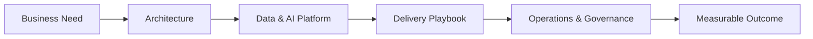

# Architecture Portfolio

  

A browsable collection of enterprise architecture, AI consulting, data engineering, cloud, and delivery artifacts. Use it as a visual companion to the implementation repositories in this portfolio.

## Why It Is Useful

This repository turns architecture from a static slide into a reviewable decision trail: business need, system boundaries, technology choices, delivery steps, governance, and operational readiness. It is designed for design reviews, discovery workshops, and technical portfolio walkthroughs.

## What You Will Find

**Data layer standard:** `RAW` → `TRANSIENT` → `BRONZE` → `SILVER` → `GOLD`, with `GOLD` as the analytics-ready serving layer.

| Area | Explore |
| --- | --- |
| Enterprise architecture | Reference architectures, system boundaries, and decision records |
| Data and AI platforms | Agentic workflows, data engineering, MLOps, and cloud patterns |
| Delivery playbooks | Project steps, build guidance, and implementation checklists |
| Consulting assets | AI consulting views, discovery material, and reusable documentation |
| Learning material | Python, architecture, and engineering study resources |

## Featured Artifacts

- **[Master documentation](Master_Documentation.html)** — portfolio index and architecture narrative
- **[Project architecture](project_architechture.html)** — system-level views and components
- **[AI consulting playbook](AI-Consulting-Playbook.html)** — consulting-oriented delivery perspective
- **[Project demo presentation](project_demo_presentation.html)** — presentation-ready project walkthrough
- **[Build playbook](BUILD_PLAYBOOK.html)** — implementation and delivery guidance

## Portfolio Map

## Related Projects

- **[Enterprise Agentic AI Platform](https://github.com/sam2881/smart-enterprise-ai-agents)** — governed incident remediation and data pipeline generation
- **[Enterprise Data Pipelines](https://github.com/sam2881/enterprise-data-pipelines)** — metadata-driven Airflow, Spark, quality, and lineage runtime
- **[GenAI Learning Path](https://github.com/sam2881/genai_learning_path)** — production-oriented GenAI and agentic AI curriculum

## How To Use This Repository

Open the HTML artifacts directly in a browser, or use the Markdown documents when you want an editable architecture narrative. Each artifact is intended to stand alone while contributing to the broader portfolio story: strategy, architecture, implementation, and operational readiness.
